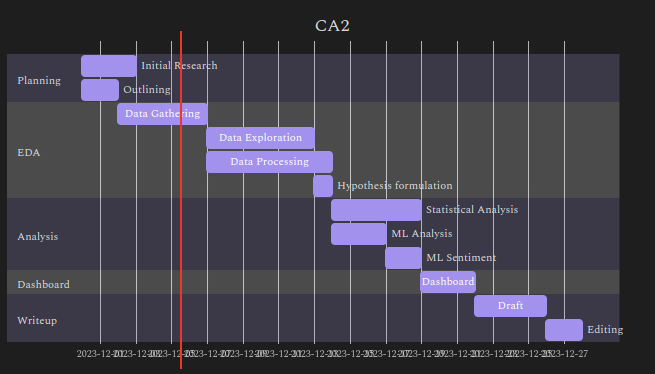

# CA2

Public bike rental schemes have been launched in many cities around Europe, including successful networks in Irish towns and cities such as Dublin, Cork, and Galway. These provide local active transport links for commuting and leisure. This project explores the publically available data pertaining to the Dublin bike network, anlayses the sentiment towards related terms using reddit comment data, makes comparisons to the London bike network, and makes predictions that could be used to manage and improve the network.

### Project Plan & approximate timeline

